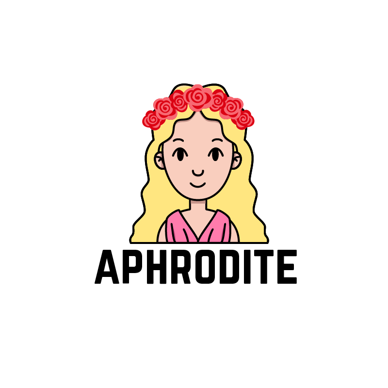

[](https://codeclimate.com/github/IcaliaLabs/aphrodite)
[](https://codeclimate.com/github/IcaliaLabs/aphrodite/coverage)
[](https://codeclimate.com/github/IcaliaLabs/aphrodite)


<div style="text-align:center">
  
</div>

Aphrodite is an open source ruby gem that acts as a wrapper for IBM Watson's [Visual Recognition service API](https://www.ibm.com/watson/developercloud/tone-analyzer.html).

## Installation

Add this line to your application's Gemfile:

```ruby
gem 'aphrodite-bot'
```

And then execute:

    $ bundle

Or install it yourself as:

    $ gem install aphrodite-bot

## Usage

### Configuration

In order for Aphrodite to work correctly, it is important that you [set up an IBM Bluemix account of your own](https://console.ng.bluemix.net/) and that your trial period hasn't ended (or, for that matter, that you've registered for a paid account)

First require the `aphrodite-bot` in your file:

```ruby
require 'aphrodite-bot'
```

Then add the following configuration block:

```ruby

Aphrodite::Bot.configure do |config|
	config.base_uri = "https://gateway-a.watsonplatform.net/visual-recognition/api/v3"
end
```

### Classify an Image

[Check Watson's API reference](https://www.ibm.com/watson/developercloud/visual-recognition/api/v3/#classify_an_image) for details on how to classify an image.

### Detect faces

[Check Watson's API reference](https://www.ibm.com/watson/developercloud/visual-recognition/api/v3/#detect_faces) for details on how to detect faces.

### Create a new Classifier
In order to create a new classifier, simply use the `Aphrodite::Bot::CustomClassifier` class' create method:

```ruby
Aphrodite::Bot::CustomClassifier.create({api_key: SOME_API_KEY, version: SOME_VERSION},
                                        {file: SOME_FILE, name: SOME_NAME})
```
`Aphrodite::Bot::CustomClassifier.create` method returns an instance of `Aphrodite::Bot::GetClassifiersTopLevelVerbose`.

[Check Watson's API reference](https://www.ibm.com/watson/developercloud/visual-recognition/api/v3/#create_a_classifier) for details on how to create a classifier.

### Get all existing Custom Classifiers
In order to get a brief list about the created classifiers, simply use the `Aphrodite::Bot::CustomClassifier` class' all method:

```ruby
Aphrodite::Bot::CustomClassifier.all(api_key: SOME_API_KEY,
                                     version: SOME_VERSION)
```
`Aphrodite::Bot::CustomClassifier.all` method returns an instance of `Aphrodite::Bot::GetClassifiersTopLevelBrief`.

In order to get a detailed list about the created classifiers, simply use the `Aphrodite::Bot::CustomClassifier` class' all method:

```ruby
Aphrodite::Bot::CustomClassifier.all(api_key: SOME_API_KEY,
                                     version: SOME_VERSION,
                                     verbose: true)
```
`Aphrodite::Bot::CustomClassifier.all` method with verbose returns an instance of `Aphrodite::Bot::GetClassifiersTopLevelVerbose`.

[Check Watson's API reference](https://www.ibm.com/watson/developercloud/visual-recognition/api/v3/#retrieve_a_list_of_classifiers) for details on how to get all existing custom classifiers.

### Find an Existing Classifier
In order to get information about a specific classifier, simply use the `Aphrodite::Bot::CustomClassifier` class' find method:

```ruby
Aphrodite::Bot::CustomClassifier.find(id: SOME_ID,
                                      {api_key: SOME_API_KEY, version: SOME_VERSION})
```

`Aphrodite::Bot::CustomClassifier.find` method returns an instance of `Aphrodite::Bot::GetClassifiersPerClassifierVerbose`.

[Check Watson's API reference](https://www.ibm.com/watson/developercloud/visual-recognition/api/v3/#retrieve_classifier_details) for details on how to find an existing classifier.

### Update an Existing Classifier
In order to update a specific classifier, simply use the `Aphrodite::Bot::CustomClassifier` class' update method:

```ruby
Aphrodite::Bot::CustomClassifier.update(id: SOME_ID,
                                      {api_key: SOME_API_KEY, version: SOME_VERSION},
                                      {file: SOME_FILE})
```

`Aphrodite::Bot::CustomClassifier.update` method returns an instance of `Aphrodite::Bot::GetClassifiersPerClassifierVerbose`.

[Check Watson's API reference](https://www.ibm.com/watson/developercloud/visual-recognition/api/v3/#update_a_classifier) for details on how to update an existing classifier.

### Delete an Existing Classifier
In order to delete a specific classifier, simply use the `Aphrodite::Bot::CustomClassifier` class' destroy method:

```ruby
Aphrodite::Bot::CustomClassifier.destroy(id: SOME_ID,
                                         {api_key: SOME_API_KEY, version: SOME_VERSION})
```
This method returns true if the Custom Classifier was successfully destroyed through Watson's API and false otherwise.

[Check Watson's API reference](https://www.ibm.com/watson/developercloud/visual-recognition/api/v3/#delete_a_classifier) for details on how to delete an existing classifier.

## Development

After checking out the repo, run `bin/setup` to install dependencies. Then, run `rake spec` to run the tests. You can also run `bin/console` for an interactive prompt that will allow you to experiment.

To install this gem onto your local machine, run `bundle exec rake install`. To release a new version, update the version number in `version.rb`, and then run `bundle exec rake release`, which will create a git tag for the version, push git commits and tags, and push the `.gem` file to [rubygems.org](https://rubygems.org).

## Contributing

Bug reports and pull requests are welcome on GitHub at https://github.com/[USERNAME]/aphrodite-bot. This project is intended to be a safe, welcoming space for collaboration, and contributors are expected to adhere to the [Contributor Covenant](http://contributor-covenant.org) code of conduct.


## License

The gem is available as open source under the terms of the [MIT License](http://opensource.org/licenses/MIT).
